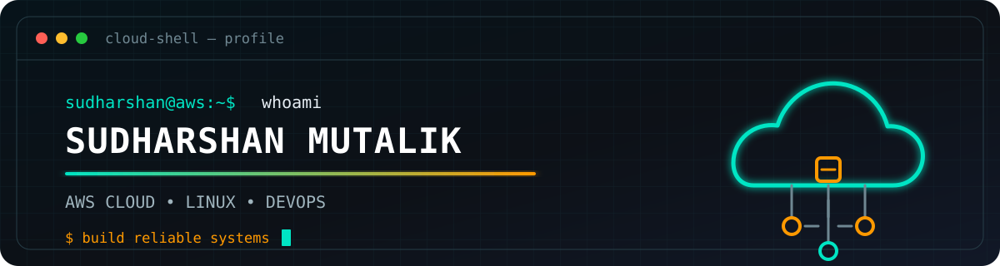

<p align="center">
  
</p>

<p align="center">
  <strong>AWS Cloud Support Engineer · Linux Administrator · DevOps Engineer</strong>
</p>

<p align="center">
  <a href="https://www.linkedin.com/in/sudharshan-mutalik"></a>
  <a href="https://github.com/SudharshanMutalik46"></a>
  
</p>

## `01 / ABOUT`

```yaml
name: Sudharshan Mutalik
location: Bengaluru, India
mission: Keep cloud systems reliable, observable, secure, and repeatable
focus:
  - AWS cloud operations and troubleshooting
  - Linux administration and networking
  - Infrastructure as Code and CI/CD
  - Kubernetes, monitoring, and incident response
open_to: AWS Cloud Support | Linux Administration | DevOps
```

I enjoy turning operational problems into documented, automated solutions—from investigating Linux and network issues to provisioning infrastructure and improving visibility with metrics and alerts.

## `02 / CLOUD TOOLBELT`

<p align="center">
  
</p>

| Area | Hands-on tools |
|---|---|
| Cloud | AWS EC2, VPC, IAM, RDS, S3, CloudWatch, Route 53 |
| Platform | Linux, Docker, Kubernetes, Amazon EKS |
| Automation | Terraform, Jenkins, GitHub Actions, Bash, Git |
| Observability | Prometheus, Grafana, CloudWatch, alerting |
| Operations | DNS, DHCP, VPN, firewalls, SSH, patching, access control |

## `03 / SELECTED DEVOPS LABS`

> These are fork-based, hands-on learning labs I use to practise Kubernetes, AWS infrastructure, Terraform, and delivery workflows.

<p align="center">
  <a href="https://github.com/SudharshanMutalik46/tier-3-application-on-Kubernetes">
    
  </a>
  <a href="https://github.com/SudharshanMutalik46/EKS-Terraform-Jenkins-project">
    
  </a>
</p>

<p align="center">
  <a href="https://github.com/SudharshanMutalik46/reddit-clone-k8s-ingress">
    
  </a>
  <a href="https://github.com/SudharshanMutalik46/E-Commerce_Website">
    
  </a>
</p>

## `04 / GITHUB SIGNAL`

<p align="center">
  
  
</p>

<p align="center">
  
</p>

## `05 / CURRENT BUILD`

```text
$ now --learning
> Kubernetes and EKS operations
> Terraform patterns and reusable infrastructure
> CI/CD reliability and deployment automation
> Monitoring, alerting, and structured troubleshooting

$ next --goal
> Build dependable cloud platforms and grow through real operational challenges
```

---

<p align="center">
  <strong>Cloud problems are puzzles. Good operations make the solution repeatable.</strong><br />
  <sub>Open to AWS Cloud Support, Linux Administrator, and DevOps opportunities.</sub>
</p>
